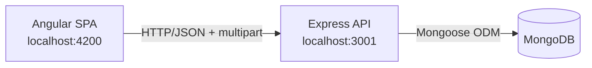

# 🏠 Home Rental System

A full-stack property rental marketplace connecting property **owners** and **tenants**. Owners list properties with photos, amenities, and house rules; tenants browse listings, leave ratings and reviews, and message owners directly through built-in chat.


---

## Features

- 🔐 **Authentication** — sign up / log in as either an **Owner** or a **Tenant**, JWT-based sessions
- 🏘️ **Property listings** — owners add properties with photos, rent, deposit, amenities, room type, and house rules
- 🔍 **Browse & filter** — tenants search all listings by room type / tenant type
- ⭐ **Reviews** — tenants rate and comment on properties
- 💬 **In-app chat** — tenants message property owners directly, per-listing
- 👤 **Profiles** — view account details; route guards restrict owner-only and tenant-only pages

## Tech stack

| Layer | Stack |
|---|---|
| Frontend | Angular 21, ng-bootstrap, Bootstrap 5, RxJS, ngx-toastr, ngx-file-drop |
| Backend | Node.js, Express, MongoDB + Mongoose, JWT, Multer (file uploads) |
| Tooling | Karma/Jasmine + Jest/Supertest (tests), ESLint (both apps), GitHub Actions (CI), nodemon (backend dev reload) |

## Architecture



The frontend talks to the backend at a base URL configured in `frontend/src/app/services/*.ts`. CORS is enabled on the backend for local cross-port development.

---

## Getting started

### Prerequisites

| Requirement | Notes |
|---|---|
| **Node.js** `^20.19.0 \|\| ^22.12.0 \|\| >=24.0.0` | Required by the Angular 21 CLI |
| **npm** | ships with Node |
| **MongoDB** | local `mongod` on `127.0.0.1:27017`, or a MongoDB Atlas connection string — not needed to run the backend test suite, which uses an in-memory MongoDB instance instead |

### 1. Backend

```bash
cd backend
npm install
cp .env.example .env      # then set JWT_SECRET and MONGODB_URI
npm run dev                # nodemon, restarts on change
```

### 2. Frontend

In a second terminal:

```bash
cd frontend
npm install
npm start                  # ng serve, http://localhost:4200
```

Open `http://localhost:4200`, sign up as an **owner** or **tenant**, and go.

### Environment variables (`backend/.env`)

| Variable | Required | Purpose |
|---|---|---|
| `PORT` | No (defaults to `3001`) | API port |
| `MONGODB_URI` | **Yes** | Mongo connection string |
| `JWT_SECRET` | **Yes** | Signs/verifies auth tokens — use a long random value |
| `ALLOWED_ORIGINS` | No (defaults to the local dev origins) | Comma-separated list of origins allowed by CORS |

---

## Project structure

```
home-rental-system/
├── backend/
│   ├── controllers/    # auth, owner, tenant, chat request handlers
│   ├── models/          # Mongoose schemas: user, property, review, chat, message
│   ├── routes/          # Express routers
│   ├── shared/           # JWT helper
│   ├── uploads/           # property photos (gitignored)
│   └── index.js           # entry point
└── frontend/
    └── src/app/
        ├── components/    # login, sign-up, properties, chat, profile...
        ├── services/      # AuthService, OwnerService, TenantService, ChatService
        └── guards/         # AuthGuard, OwnerGuard, TenantGuard
```

## Testing & CI

```bash
# Backend — Jest + Supertest against an in-memory MongoDB instance
cd backend
npm run lint
npm test

# Frontend — Karma/Jasmine in headless Chrome
cd frontend
npm run lint
npm run test:ci
```

Every PR into `main` (and every push to `main`) runs `.github/workflows/ci.yml`: lint + test + `npm audit` for both apps, plus a [gitleaks](https://github.com/gitleaks/gitleaks) secret scan over the full commit history. See [DEV_NOTES.md](DEV_NOTES.md) for why the backend's audit gate is stricter (`--audit-level=high`) than the frontend's (`--audit-level=critical`).

## API reference

| Method | Path | Purpose |
|---|---|---|
| POST | `/signUp` | Register a user (`owner` or `tenant`) |
| POST | `/login` | Authenticate, returns a JWT |
| GET | `/profile/:id` | Get a user's profile |
| POST | `/addProperty/:id` | Owner creates a listing (multipart, with photos) |
| GET | `/myProperties/:id` | Properties owned by a given owner |
| GET | `/allProperties` | Browse all listings |
| GET | `/propertyDetails/:id` | Single listing detail |
| POST | `/addReview` | Tenant adds a rating/comment |
| GET | `/reviews/:id` | Reviews for a property |
| POST | `/chat-with-owner` | Start (or reuse) a chat thread |
| POST | `/msg` | Send a chat message |
| GET | `/get-chat-list/:role/:userId` | List a user's chat threads |
| GET | `/get-chat-by-id/:userId/:chatId` | Messages in a thread |

---

For architecture decisions, known limitations, and the improvement roadmap, see **[DEV_NOTES.md](DEV_NOTES.md)**.
